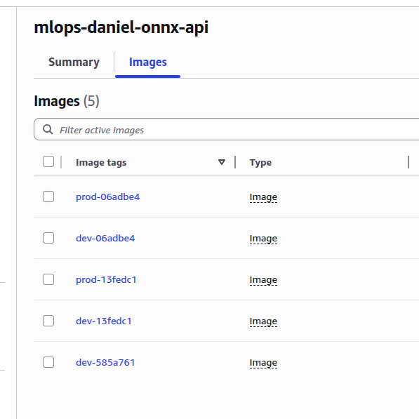
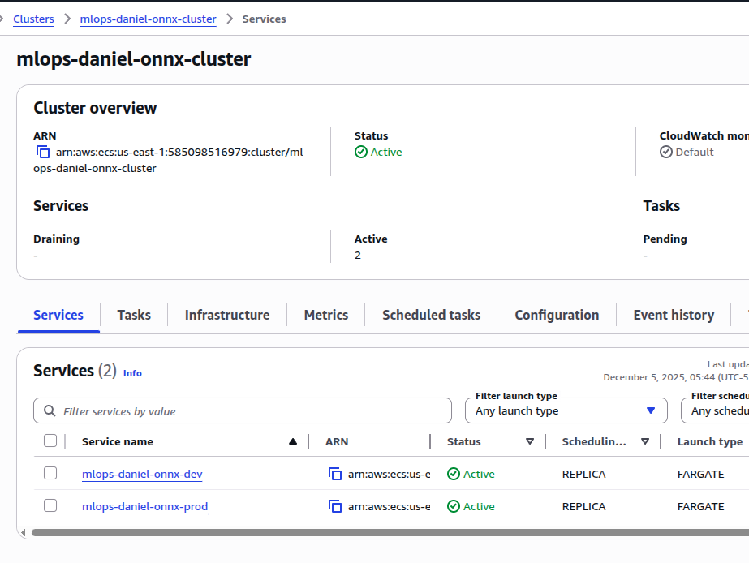
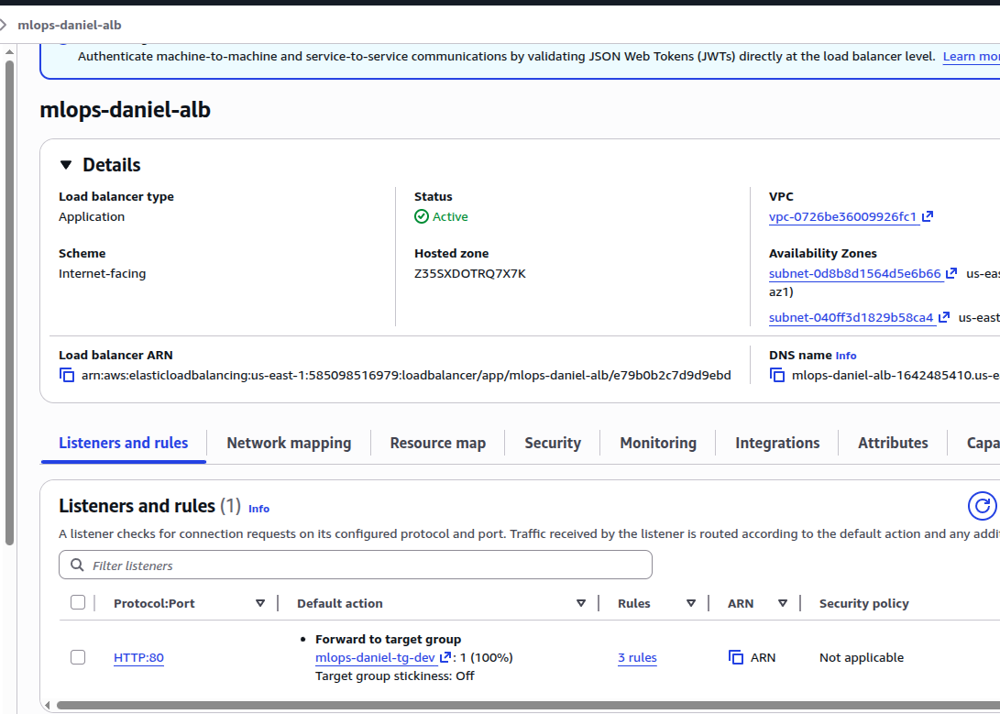
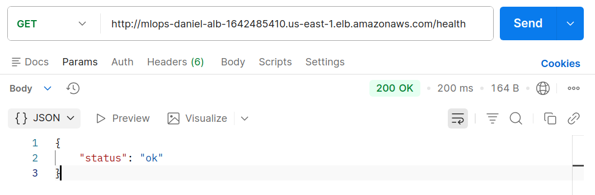
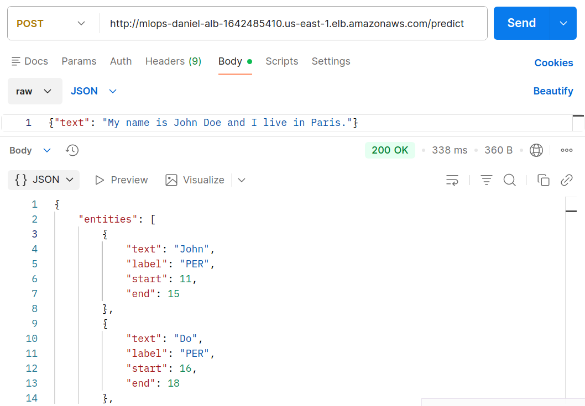

#  **Proyecto MLOps – Sistema de Despliegue Automático para Modelo ONNX**

## **AUTOR:** Daniel Garcia Mendez

Este proyecto implementa un sistema completo de **despliegue automático** para un modelo de Machine Learning **preexistente en formato ONNX**, cumpliendo todos los requisitos definidos en el documento del curso “Sistemas de despliegue automático” .

La solución permite:

* Deploy automático a **dos entornos independientes**: `dev` y `prod`.
* Estructura CI/CD que prueba, construye, publica e implementa un contenedor.
* Registro de predicciones en archivos TXT en S3 para auditoría.

---

# 1. **Descripción general del sistema**

El repositorio contiene:

* Una aplicación FastAPI que carga un modelo ONNX desde S3
* Un pipeline CI/CD unificado (GitHub Actions) que ejecuta:

  * **test** → descarga test_data y modelo desde S3 y ejecuta pruebas unitarias.
  * **build/promote** → construye Docker image y despliega en AWS ECS.
* Dos endpoints independientes:

  * `/dev/...` (rama dev → servicio ECS dev)
  * `/prod/...` (rama prod → servicio ECS prod)

Cada push a `dev` o `prod` dispara automáticamente el pipeline.

---

# 2. **Arquitectura**

```
                ┌──────────────┐
                │   GitHub     │
                │  Repository  │
                └──────┬───────┘
                       │ push (dev/prod)
                       ▼
            ┌──────────────────────┐
            │ GitHub Actions CI/CD │
            └──────┬───────┬───────┘
                   │       │
      test stage   │       │   build/promote stage
   (download S3)   │       │   (docker build + push)
                   ▼       ▼
           ┌────────────────────┐
           │   Amazon ECR       │
           └────────┬───────────┘
                    │  new image
                    ▼
     ┌──────────────────────────────────┐
     │             Amazon ECS           │
     │   dev-service      prod-service  │
     │   (task dev)       (task prod)   │
     └──────────┬──────────────┬────────┘
                │              │
         ┌──────▼───────┐ ┌────▼────────┐
         │ /dev/predict │ │/prod/predict│
         └──────────────┘ └─────────────┘
                │                │
                ▼                ▼
      S3 logs bucket:   S3 logs bucket:
  predictions_dev.txt   predictions_prod.txt
```

---

# 3. **Estructura del repositorio**

```
app/
  main.py
  model_loader.py
  predictor.py
  logging_utils.py
  requirements.txt

tests/
  test_inference_response.py
  test_metric_threshold.py

.github/workflows/
  ci_cd.yml

infra/ (opcional)
  terraform/ scripts / comandos de ejemplo

config/
  env.example

Dockerfile
README.md
```

---

# 4. **Flujo CI/CD: dev vs prod**

### Push a `dev`

1. Se descarga test_data + modelo desde S3.
2. Se corren pruebas unitarias.
3. Se construye image Docker → push a ECR.
4. Se actualiza el servicio ECS `dev`.
5. `/dev/predict` queda listo para usar.

### Push a `prod`

Igual que dev, pero actualiza el servicio ECS `prod`, que expone `/prod/predict`.

---

# 5. **Infraestructura en AWS**

### Buckets S3 (ejemplo usado)

| Uso         | Bucket                      | Key                    |
| ----------- | --------------------------- | ---------------------- |
| Modelo ONNX | `mlops-daniel-model-bucket` | `model.onnx`           |
| Test data   | `mlops-daniel-model-bucket` | `test_data.json`       |
| Logs dev    | `mlops-daniel-logs-bucket`  | `predictions_dev.txt`  |
| Logs prod   | `mlops-daniel-logs-bucket`  | `predictions_prod.txt` |

### Amazon ECR

Almacena las imágenes Docker generadas por CI/CD.



### Amazon ECS (Fargate)

* Servicio **dev** y servicio **prod**
* Cada uno con su propia task definition
* Cada task obtiene modelo desde S3 en tiempo de arranque



### Application Load Balancer

* `/dev/...` → ECS dev
* `/prod/...` → ECS prod



---

# 6. **Aplicación FastAPI**

Funciones principales:

* Descarga el modelo ONNX desde S3 al iniciar.
* Usa ONNX Runtime para inferencia.
* Endpoint principal:

  ```
  POST /predict
  {
     "text": "Daniel vive en Cali"
  }
  ```
* Retorna entidades NER.
* Guarda cada predicción como una línea JSON en S3:

  * `predictions_dev.txt`
  * `predictions_prod.txt`

---

# 7. **Pruebas unitarias**

### 1. Test de respuesta del modelo

Confirma que el modelo ONNX responde a un input válido.

### 2. Test de métrica mínima

Calcula F1 usando `test_data.json` y valida que cumpla un umbral.

Ambos tests se ejecutan automáticamente en CI/CD y deben pasar para continuar al despliegue.

---

# 8. **Ejecución local**

```
docker build -t onnx-app .
docker run -p 8000:8000 \
   -e MODEL_S3_BUCKET=mlops-daniel-model-bucket \
   -e MODEL_S3_KEY=model.onnx \
   -e AWS_REGION=us-east-1 \
   -e ENVIRONMENT=dev \
   -e PREDICTIONS_S3_BUCKET=mlops-daniel-logs-bucket \
   -e PREDICTIONS_S3_KEY=predictions_dev.txt \
   onnx-app
```

---

# 9. **Variables de entorno necesarias**

```
AWS_REGION
ENVIRONMENT
MODEL_S3_BUCKET
MODEL_S3_KEY
PREDICTIONS_S3_BUCKET
PREDICTIONS_S3_KEY
LOCAL_MODEL_PATH
MIN_ACCEPTABLE_ACCURACY
```

Todas se pueden cambiar sin tocar el código.

# 10. **Endpoints**

El modelo es accesible por la web mediante una api, se puede obtener el estado con las siguientes direcciones:

```
http://mlops-daniel-alb-1642485410.us-east-1.elb.amazonaws.com/health
```
Rama dev:

```
http://mlops-daniel-alb-1642485410.us-east-1.elb.amazonaws.com/dev/health
```
Rama prod:

```
http://mlops-daniel-alb-1642485410.us-east-1.elb.amazonaws.com/prod/health
```

Ejemplo del punto `health` con postman:


Para acceder al modelo se tienen los siguientes puntos:

Url:

```
http://mlops-daniel-alb-1642485410.us-east-1.elb.amazonaws.com/predict
```

json:

```json
{"text": "My name is John Doe and I live in Paris."}
```

Url rama dev:

```
http://mlops-daniel-alb-1642485410.us-east-1.elb.amazonaws.com/dev/predict
```

json rama dev:

```json
{"text": "My name is John Doe and I live in Paris."}
```

Url rama prod:

```
http://mlops-daniel-alb-1642485410.us-east-1.elb.amazonaws.com/prod/predict
```

json rama prod:

```json
{"text": "My name is John Doe and I live in Paris."}
```

Ejemplo de punto `predict` con postman:


